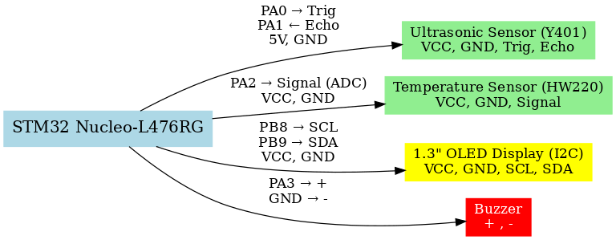

# 🧑‍💻 Smart Wellness Desk Assistant

An embedded AI project developed during a **3-Day Workshop on Designing Embedded AI Systems using STMicroelectronics AI Ecosystem**, organized by **DigiToad Technologies Pvt. Ltd.**, Bangalore, in collaboration with **STMicroelectronics** and **BITM Bellary**.

---

## 🚀 Features
- 👤 **User Presence Detection** → Ultrasonic Sensor (Y401)  
- 🌡️ **Temperature Monitoring** → HW220 sensor with OLED feedback  
- 🖥️ **OLED Display Messages** → `"Waiting for user"`, `"Moderate temp, stay hydrated"`, `"Too hot, turn on AC"`  
- ⏳ **Break Reminder** → Buzzer alert after 1-hour sitting time  
- ⏱️ **Absence Reset** → System resets after 30 seconds of no user detected  

---

## 🛠️ Hardware
- STM32 Nucleo-L476RG (Cortex-M4)  
- Ultrasonic Sensor (Y401 / HC-SR04 compatible)  
- HW220 Temperature Sensor (Analog input via ADC)  
- 1.3” OLED Display (I2C)  
- Buzzer  

---

## 🔌 Wiring Diagram
Here’s the connection overview of the Smart Wellness Desk Assistant:

---

## 📂 Repository Structure
- │── README.md  
- │── /Code 
- │ └── STM32CubeIDE_Code.c  
- │── /Docs  
- │ └── Smart_Wellness_Desk_Assistant_Setup_Guide.pdf
- │ └── STM32CubeIDE_Code_and_Pin_Connections.pdf  
- │── /Media  
- │ └── Certificate.jpg  
- │ └── Demo_Video.mp4

